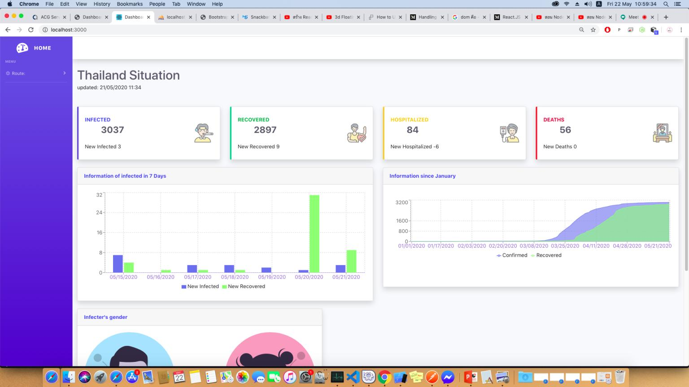
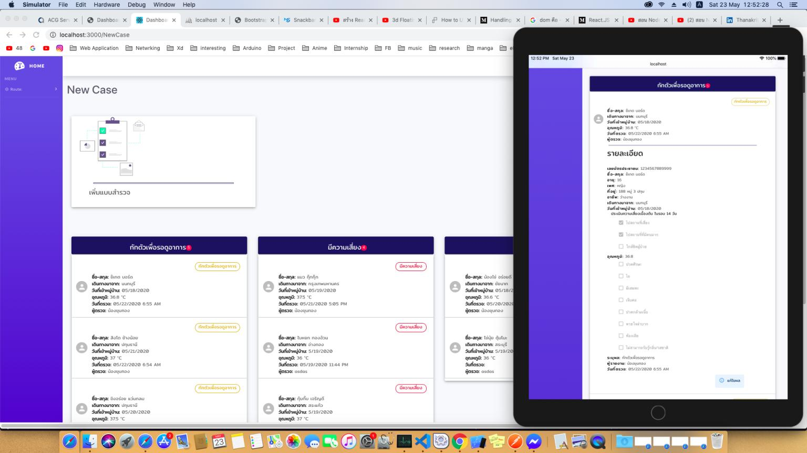
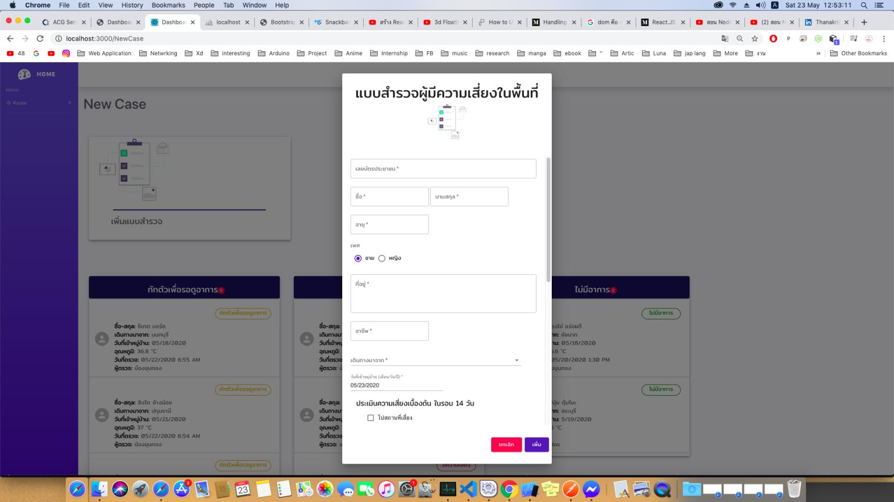
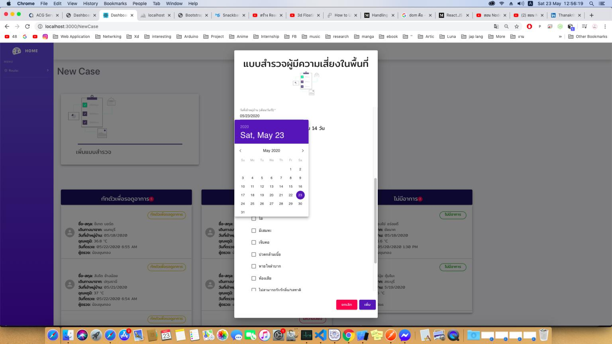
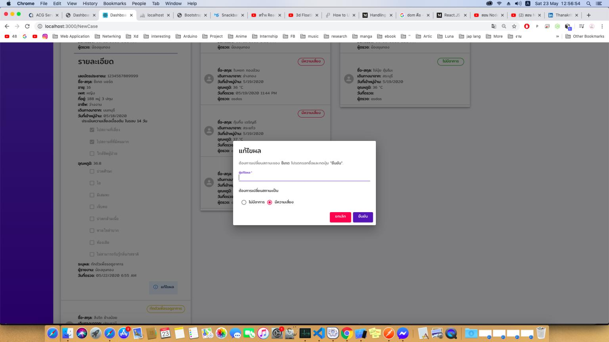

Internship project: Survey the people who are risk from Covid-19

My dad, he is working in public health department
I want him to use this to survey people in the local area and I want to reduce using paper for survey just bring laptop or tablet to.

It's not done yet. I have to do more feature.

